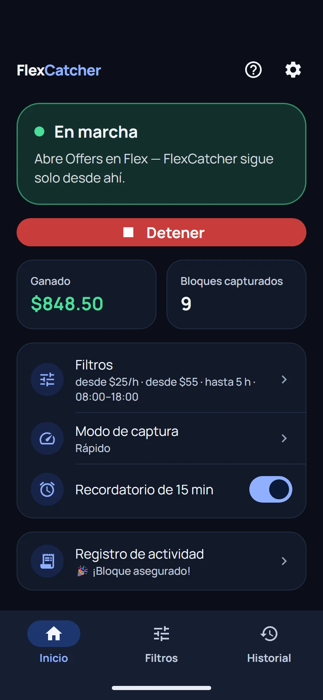
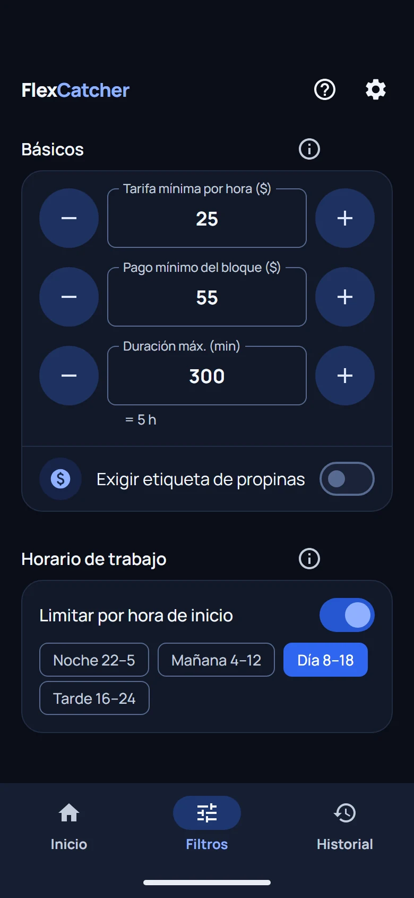

# Bot para Amazon Flex (2026): cómo funcionan y qué revisar antes de instalar uno

[English](README.md) · Español · [Русский](README.ru.md)

Lo escribe el equipo de [FlexCatcher](https://flexcatcher.app?utm_source=github), una app de Android que agarra bloques de Amazon Flex en tu propio teléfono. Hacemos una de estas herramientas, así que tómalo como la guía de quien la fabrica. Las comprobaciones sirven para cualquier bot de Amazon Flex, también para el nuestro.

Actualizado en octubre de 2026.

## ¿Qué es un bot de Amazon Flex?

Un bot de Amazon Flex actualiza la pantalla de Offers por ti y acepta un bloque antes que otro conductor. También lo llaman bot para agarrar bloques, block grabber, auto clicker o auto tapper.

Existen porque los buenos bloques desaparecen en segundos. Sin una herramienta tienes que dejar la app de Flex abierta y actualizar a mano, y mientras esperas no puedes hacer otra cosa.

## Tres tipos de bots para Amazon Flex

| | Bot en la nube o script | Auto clicker | App en el teléfono |
|:---|:---|:---|:---|
| Dónde funciona | En un servidor ajeno | En tu teléfono | En tu teléfono |
| Pide tu correo y contraseña de Flex | Sí | No | No |
| Elige bloques según tus filtros | Depende | No | Sí |

Un bot en la nube entra a tu cuenta de Flex desde su propio servidor, por eso necesita tu correo y tu contraseña. Los scripts viejos que hay en GitHub funcionan igual. Si buscas cómo crear un bot para Amazon Flex, casi todos esos proyectos piden tu login y los más conocidos llevan años sin actualizarse.

Un auto clicker toca un punto fijo de la pantalla cada cierto tiempo. No lee la oferta, así que agarra un bloque que no querías igual que uno bueno.

Una app en el teléfono lee la pantalla de Offers con la Accesibilidad de Android, compara cada oferta con tus filtros y toca Aceptar solo cuando una cumple, como lo harías tú. Así funciona FlexCatcher.

<a href="https://www.youtube.com/watch?v=FeSxwQWoZA8">Mira la demo de FlexCatcher en YouTube</a> (en inglés)

Más detalle: [Cómo funcionan los bots de Amazon Flex](https://blog.flexcatcher.app/es/how-amazon-flex-bots-work/) y [Auto tappers y bots para Amazon Flex](https://blog.flexcatcher.app/es/auto-tapper-guide/).

## ¿Están permitidos los bots de Amazon Flex? ¿Amazon los detecta?

Amazon no los permite y los busca. En [su propia publicación sobre bots](https://flex.amazon.com/blog/how-amazon-flex-is-helping-delivery-partners-schedule-work-by-removing-bots) (en inglés), Amazon Flex dice que usa aprendizaje automático para encontrar las cuentas que usan bots, avisa al conductor y elimina la cuenta si sigue. También muestra un CAPTCHA en la pantalla de ofertas cuando la actividad parece automática y bloquea las solicitudes que cree que vienen de un bot.

Cualquier herramienta de terceros conlleva cierto riesgo, también FlexCatcher. Lee los términos de Flex antes de instalar una. Más sobre esto: [Por qué los bots de Amazon Flex hacen que te marquen la cuenta](https://blog.flexcatcher.app/es/cloud-bots-dangers/) y [Amazon Flex CAPTCHA jail](https://blog.flexcatcher.app/es/captcha-jail/).

## Cómo elegir el mejor bot para Amazon Flex: 6 cosas que revisar

1. No te pide el correo ni la contraseña de Amazon Flex. Si los pide, entra a tu cuenta desde otro lugar.
2. Funciona en tu teléfono, no en un servidor.
3. Tiene filtros de verdad: tarifa mínima por hora, pago mínimo del bloque, duración máxima, horario de trabajo y estaciones. Sin filtros acepta lo que aparezca.
4. Se detiene cuando la app de Flex muestra una verificación y te devuelve la pantalla.
5. Sabes de dónde viene el archivo de instalación: un APK firmado con el checksum publicado.
6. Puedes probarlo antes de pagar, y la página de venta no te promete cuántos bloques vas a agarrar ni que tu cuenta está protegida.

Lo mismo con ejemplos: [Bot de Amazon Flex: qué revisar antes de instalarlo](https://blog.flexcatcher.app/es/amazon-flex-bot/). Para buscar una herramienta por su nombre: [Lista de bots de Amazon Flex](https://blog.flexcatcher.app/es/amazon-flex-bot-list/).

## ¿Hay bot de Amazon Flex para iPhone?

Un bot que lee la pantalla de Offers en el teléfono necesita Android. Android deja que una app con permiso de Accesibilidad lea la pantalla de otra app y toque por ti, y el iPhone no les da ese acceso a las apps de terceros. Lo que se vende como bot de Amazon Flex para iPhone es un servicio en la nube que se queda con tu login de Flex, un auto clicker a ciegas o un segundo teléfono.

FlexCatcher es una app de Android: Android 8.0 o superior, mínimo 3 GB de RAM, sin root. Más en [Bot de Amazon Flex para iPhone: qué hay, qué no y por qué](https://blog.flexcatcher.app/es/amazon-flex-bot-iphone/).

## FlexCatcher: un bot para Amazon Flex que funciona en tu teléfono

  &nbsp;&nbsp;
  

Pantallas de la app. Datos de ejemplo.

FlexCatcher vigila la pantalla de Offers en tu teléfono y acepta los bloques que cumplen tus filtros. Todo funciona en tu teléfono: sin login, sin contraseña, sin acceso remoto a tu cuenta. Lo hizo un conductor de Flex, para conductores de Flex.

- Filtros: tarifa mínima por hora, pago mínimo del bloque, duración máxima, horario de trabajo, estaciones.
- Cuatro modos de captura. Tres hacen pausas solos; el temporizador funciona sin pausas de 15 a 45 minutos y luego se detiene.
- Si la app de Flex muestra una verificación, FlexCatcher se detiene y te espera.
- Te avisa cuando agarra un bloque y guarda el historial con estación, pago y tarifa por hora.
- Pide un solo permiso, el de Accesibilidad, y puedes desactivarlo cuando quieras.
- La app está en español, inglés y ruso.

**[Prueba FlexCatcher gratis 7 días](https://flexcatcher.app?utm_source=github)**. Sin tarjeta, sin contraseña.

## Más guías de Amazon Flex en español

- [Bot y grabber de bloques para Amazon Flex: velocidad y seguridad](https://blog.flexcatcher.app/es/best-alternatives/)
- [Cómo conseguir más bloques de Amazon Flex](https://blog.flexcatcher.app/es/how-to-get-more-blocks/)
- [Amazon Flex Start Soon: bloques de inicio cercano](https://blog.flexcatcher.app/es/amazon-flex-start-soon/)
- [Todas las guías en español](https://blog.flexcatcher.app/es/)

## Sigue a FlexCatcher

[YouTube](https://www.youtube.com/@flexcatcher) · [TikTok](https://www.tiktok.com/@flexcatcher) · [Instagram](https://www.instagram.com/flexcatcher/) · [Threads](https://www.threads.com/@flexcatcher)

## Aviso

FlexCatcher es una app independiente, sin relación con Amazon. Amazon Flex es una marca registrada de Amazon.com, Inc. o sus filiales. Este repositorio es solo una guía: no tiene código, APK ni scripts.
