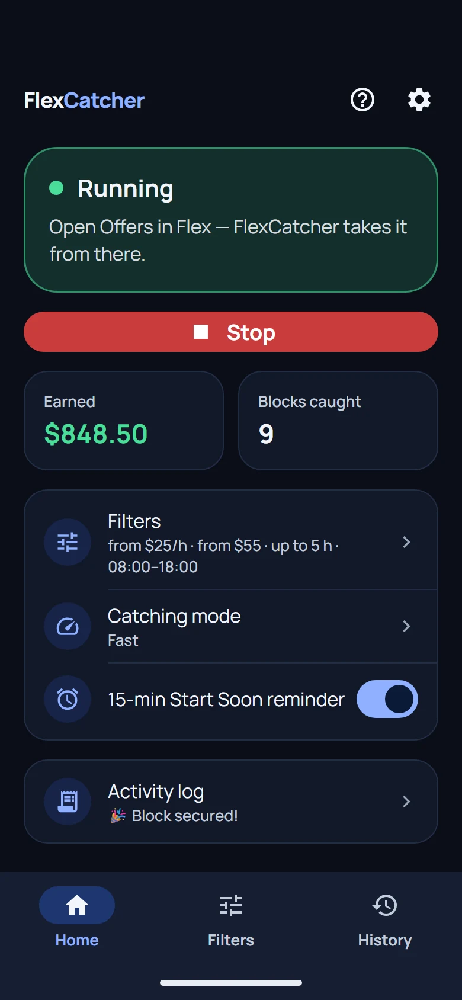
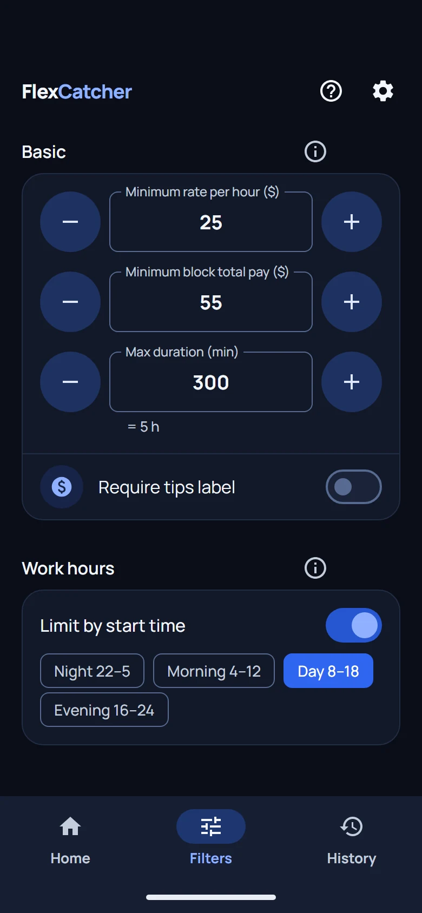
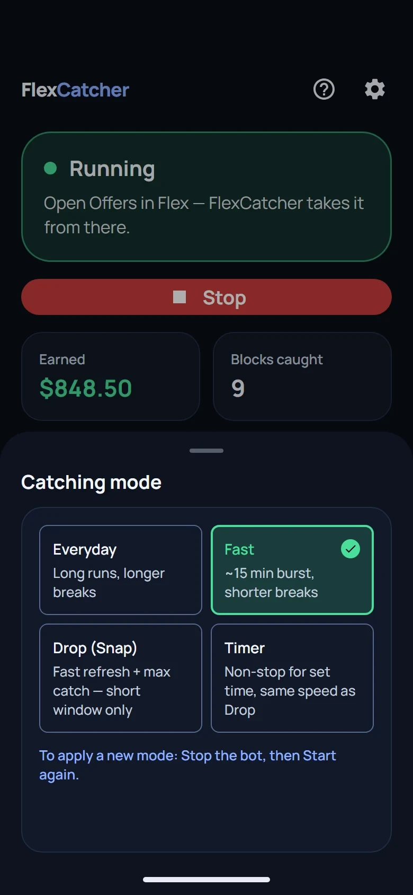

# Amazon Flex bot (2026): block grabbers, auto clickers and on-phone apps compared

Written by the team behind [FlexCatcher](https://flexcatcher.app?utm_source=github), an Android app that catches Amazon Flex blocks on your own phone. We build one of these tools, so read this as a maker's guide: what each kind of Amazon Flex bot does, what it puts at risk, and how to check one before you install it. The checks work on any block grabber, ours included.

Updated October 2026.

## Contents

- [What is an Amazon Flex bot?](#what-is-an-amazon-flex-bot)
- [Three kinds of Amazon Flex bots and block grabbers](#three-kinds-of-amazon-flex-bots-and-block-grabbers)
- [Do Amazon Flex bots work?](#do-amazon-flex-bots-work)
- [Are Amazon Flex bots allowed, and can Amazon detect them?](#are-amazon-flex-bots-allowed-and-can-amazon-detect-them)
- [How to pick the best Amazon Flex bot: 6 checks](#how-to-pick-the-best-amazon-flex-bot-6-checks)
- [Amazon Flex bot for iPhone or Android](#amazon-flex-bot-for-iphone-or-android)
- [FlexCatcher: an Amazon Flex bot that stays on your phone](#flexcatcher-an-amazon-flex-bot-that-stays-on-your-phone)
- [Amazon Flex bot FAQ](#amazon-flex-bot-faq)
- [More Amazon Flex guides](#more-amazon-flex-guides)

## What is an Amazon Flex bot?

An Amazon Flex bot refreshes the Offers screen for you and accepts a block before another driver gets it. Drivers call the same thing a Flex bot, flexbot, block grabber, flex grabber, block catcher, auto clicker or auto tapper, and some just search for an app to get Amazon Flex blocks.

These tools exist because good blocks disappear in seconds. Without one, you keep the Flex app open and refresh by hand, and while you wait for a block you can't do much else.

## Three kinds of Amazon Flex bots and block grabbers

| | Cloud bot or script | Auto clicker, auto tapper | On-phone app |
|:---|:---|:---|:---|
| Where it runs | A server you don't control | Your phone | Your phone |
| Asks for your Flex email and password | Yes | No | No |
| Picks blocks by your filters | Depends on the tool | No | Yes |

A cloud bot signs in to your Flex account from its own server, so it needs your email and password. The account you get paid through is then logged in somewhere that isn't your phone. The old Amazon Flex scripts you find on GitHub work the same way: they talk to Flex with your login from whatever computer runs them, and the popular ones haven't been updated in years.

An auto clicker taps a fixed spot on the screen on a timer. It never reads the offer, so it grabs a block you would skip as readily as one you want, and it reacts in exactly the same rhythm every time.

An on-phone app reads the Offers screen through Android Accessibility, compares each offer with your filters and taps Accept only when one matches, the way you would. FlexCatcher works this way.

<a href="https://www.youtube.com/watch?v=FeSxwQWoZA8">Watch the FlexCatcher demo on YouTube</a>

More detail: [How Amazon Flex bots work](https://blog.flexcatcher.app/how-amazon-flex-bots-work/) and [Amazon Flex auto tappers: how they work and what to watch for](https://blog.flexcatcher.app/auto-tapper-guide/).

## Do Amazon Flex bots work?

A bot reacts faster than a thumb and keeps refreshing while you do something else. It can't make blocks appear, though: it only sees the offers Flex shows you. No tool can promise you a block, and a tool that does is selling the promise.

## Are Amazon Flex bots allowed, and can Amazon detect them?

Amazon doesn't allow them, and it looks for them. In [its own post about bots](https://flex.amazon.com/blog/how-amazon-flex-is-helping-delivery-partners-schedule-work-by-removing-bots), Amazon Flex says it uses machine learning to find accounts that use bots, warns the driver and removes the account if it continues. It also shows a CAPTCHA on the Offers screen when activity looks automated, and it blocks requests it believes come from bots. The Flex agreement restricts automated tools, and accounts do get deactivated.

So any third-party tool carries some risk, FlexCatcher included. Read the Flex terms before you install one. Drivers who refresh by hand hit the same CAPTCHA, which we cover in [Amazon Flex CAPTCHA jail](https://blog.flexcatcher.app/captcha-jail/). Which setups get noticed first is in [Why Amazon Flex bots get accounts flagged](https://blog.flexcatcher.app/cloud-bots-dangers/).

## How to pick the best Amazon Flex bot: 6 checks

1. It never asks for your Amazon Flex email or password. A tool that does signs in to your account from somewhere else.
2. It runs on your phone, not on a server.
3. It has real filters: minimum pay per block, minimum hourly rate, maximum block length, working hours and stations. Without filters it accepts whatever shows up.
4. It stops when the Flex app shows a verification check and hands the screen back to you.
5. You know where the install file comes from: a signed APK with a published checksum.
6. You can try it before you pay, and the sales page makes no promises about how many blocks you'll get or that your account is protected.

The same checks with examples: [Amazon Flex bot: what to check before you install one](https://blog.flexcatcher.app/amazon-flex-bot/). To look up a tool by name, see the [Amazon Flex bot list](https://blog.flexcatcher.app/amazon-flex-bot-list/).

## Amazon Flex bot for iPhone or Android

A bot that reads the Offers screen on the phone needs Android. Android lets an app with Accessibility permission read another app's screen and tap it for you, and iPhone doesn't give third-party apps that kind of access. What is sold as an Amazon Flex bot for iPhone is a cloud service that takes your Flex login, a blind auto clicker, or a second phone. If it asks for your Flex email and password, that brings back check 1.

FlexCatcher is an Android app: Android 8.0 or newer, 3 GB of memory or more, no root. For a driver with an iPhone, the workable setup is a second, cheap Android phone.

More on this: [Amazon Flex bot for iPhone: what exists, what doesn't, and why](https://blog.flexcatcher.app/amazon-flex-bot-iphone/).

## FlexCatcher: an Amazon Flex bot that stays on your phone

  &nbsp;&nbsp;
  &nbsp;&nbsp;
  

Screens from the app. Sample data.

FlexCatcher is an Amazon Flex block grabber for Android, built by a Flex driver, for Flex drivers. It watches one screen, your Offers list, and accepts a block that matches your filters, just like you tapped the button.

- Filters: minimum hourly rate, minimum pay per block, maximum block length, working hours, stations.
- Four catch modes: Everyday (long runs, longer breaks), Fast (a burst of about 15 minutes when blocks are dropping), Drop (for a drop you know is coming) and Timer (runs without breaks for 15 to 45 minutes, then stops).
- Everyday, Fast and Drop take breaks on their own.
- If the Flex app shows a verification check, FlexCatcher stops and waits for you.
- A notification when a block is caught, and a history with station, pay and hourly rate.
- An optional reminder before a block starts.
- No login, no password, no remote access to your account. It needs one Accessibility permission, and you can turn it off at any time.
- In English, Spanish and Russian.

How it works:

1. Turn on one permission: FlexCatcher under Accessibility.
2. Set how much a block has to pay.
3. Tap Start, open the Offers screen and keep it open.
4. A matching block is accepted and you get a notification.

**[Try FlexCatcher free for 7 days](https://flexcatcher.app?utm_source=github)**. No card, no password.

## Amazon Flex bot FAQ

### Is there a free Amazon Flex bot?

FlexCatcher has a free trial: 7 days of full access, one trial per device, no card.

### Where do I download the Amazon Flex bot APK?

On [flexcatcher.app](https://flexcatcher.app?utm_source=github). The APK is signed, and its checksum is published on the same page.

### Does FlexCatcher need my Amazon Flex password?

No. It never asks for your Flex login. It reads the Offers screen on your phone.

### Is there an Amazon Flex bot script on GitHub?

There are old scripts, and they sign in with your Flex email and password. This repository has no code: it's a guide. FlexCatcher is a finished Android app on [flexcatcher.app](https://flexcatcher.app?utm_source=github).

### Are Amazon Flex bots legit?

Some are working tools. Before you trust one, run the six checks above, and treat any page that promises a number of blocks or says your account can't be flagged as an ad.

### Can Amazon Flex detect an auto clicker?

Amazon says it looks for activity that seems automated and shows a CAPTCHA when it finds it. An auto clicker taps on a fixed timer and never reads the offer, so it also accepts blocks you don't want.

### Can I lose my Flex account using a bot?

Yes, you can. See [Are Amazon Flex bots allowed, and can Amazon detect them?](#are-amazon-flex-bots-allowed-and-can-amazon-detect-them) above.

## More Amazon Flex guides

- [Amazon Flex bot list: the names drivers search for](https://blog.flexcatcher.app/amazon-flex-bot-list/)
- [Amazon Flex bot for iPhone](https://blog.flexcatcher.app/amazon-flex-bot-iphone/)
- [Amazon Flex block grabber options: speed and safety compared](https://blog.flexcatcher.app/best-alternatives/)
- [Amazon Flex issues and how to avoid them](https://blog.flexcatcher.app/amazon-flex-issues-how-to-avoid/)
- [How to get more Amazon Flex blocks](https://blog.flexcatcher.app/how-to-get-more-blocks/)
- [Amazon Flex "Start Soon": what it means for drivers](https://blog.flexcatcher.app/amazon-flex-start-soon/)
- [The Amazon Flex Request tab explained](https://blog.flexcatcher.app/amazon-flex-request-blocks-update/)
- [All guides on blog.flexcatcher.app](https://blog.flexcatcher.app/)
- En español: [Bot para Amazon Flex](https://blog.flexcatcher.app/es/amazon-flex-bot/)

## Follow FlexCatcher

[YouTube](https://www.youtube.com/@flexcatcher) · [TikTok](https://www.tiktok.com/@flexcatcher) · [Instagram](https://www.instagram.com/flexcatcher/) · [Threads](https://www.threads.com/@flexcatcher)

## Disclaimer

FlexCatcher is an independent app, not affiliated with Amazon. Amazon Flex is a trademark of Amazon.com, Inc. or its affiliates. This repository contains a guide only: no code, no APK, no scripts.
