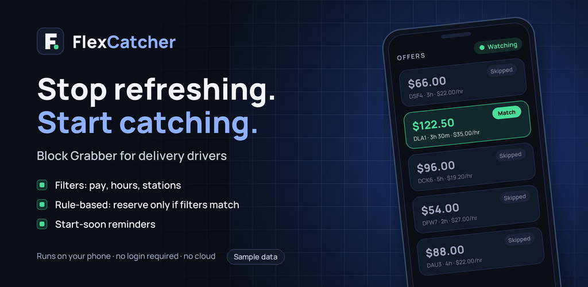
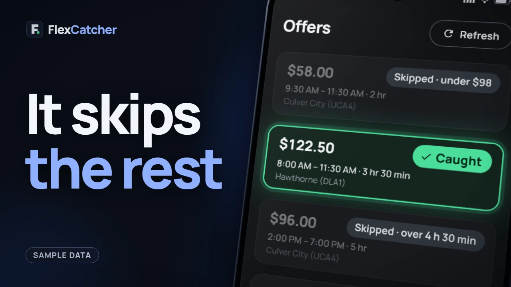
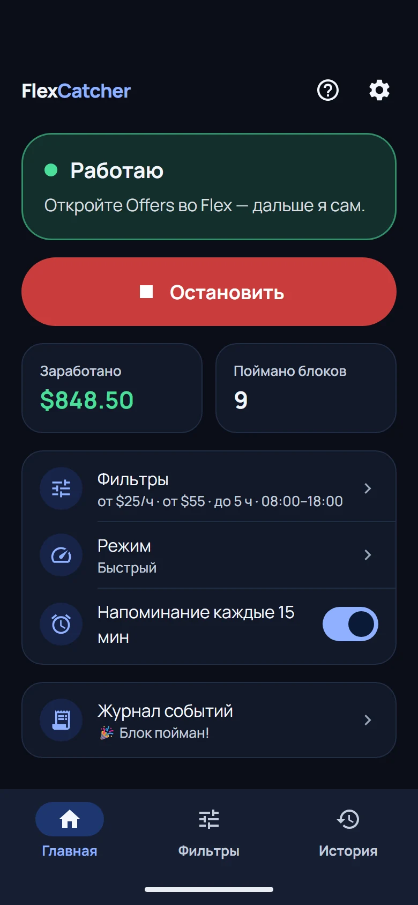
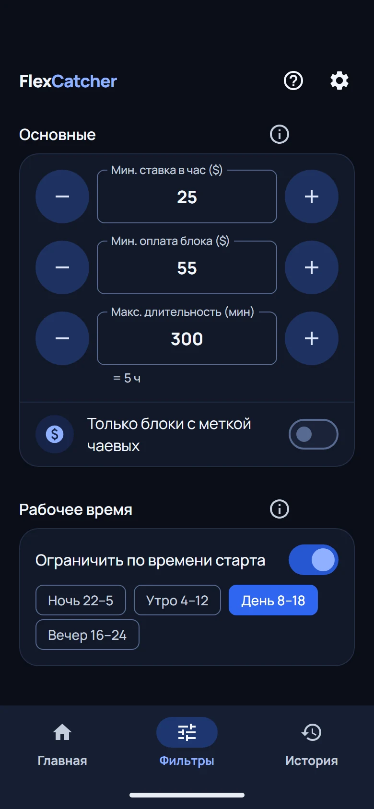

# Бот для Amazon Flex (2026): блок-грабберы, автокликеры и приложения на телефоне

[English](README.md) · [Español](README.es.md) · Русский

Гайд написала команда [FlexCatcher](https://flexcatcher.app?utm_source=github), Android-приложения, которое ловит блоки Amazon Flex на твоём телефоне. Один из таких инструментов делаем мы, так что читай это как гайд от разработчиков: что делает каждый вид Amazon Flex бота, чем он рискует и как проверить его до установки. Проверки подходят к любому блок-грабберу, и к нашему тоже.

Обновлено в октябре 2026.

## Что такое бот для Amazon Flex

Amazon Flex бот сам обновляет экран Offers и принимает блок раньше, чем его заберёт другой водитель. Водители называют это по-разному: Flex бот, flexbot, блок граббер, flex grabber, ловец блоков, автокликер, автотаппер. Кто-то просто ищет приложение, чтобы получать блоки Amazon Flex.

Такие инструменты появились потому, что хорошие блоки разбирают за секунды. Без бота ты держишь приложение Flex открытым и обновляешь руками, а пока ждёшь блок, ничем другим заняться не получается.

## Три вида ботов и блок-грабберов для Amazon Flex

| | Облачный бот или скрипт | Автокликер, автотаппер | Приложение на телефоне |
|:---|:---|:---|:---|
| Где работает | На сервере, который ты не контролируешь | На твоём телефоне | На твоём телефоне |
| Просит email и пароль от Flex | Да | Нет | Нет |
| Выбирает блоки по твоим фильтрам | Зависит от инструмента | Нет | Да |

Облачный бот заходит в твой аккаунт Flex со своего сервера, поэтому ему нужны твои email и пароль. Аккаунт, через который тебе платят, оказывается залогинен где-то не на твоём телефоне. Старые скрипты для Amazon Flex на GitHub работают так же: они говорят с Flex под твоим логином с любого компьютера, где их запустили, а популярные не обновлялись годами.

Автокликер нажимает в одну и ту же точку экрана по таймеру. Предложение он не читает, поэтому берёт и тот блок, который ты бы пропустил, и тот, который нужен, и реагирует каждый раз в одном и том же ритме.

Приложение на телефоне читает экран Offers через Android Accessibility, сверяет каждое предложение с твоими фильтрами и нажимает Accept, только когда оно подошло, как сделал бы ты сам. FlexCatcher работает именно так.

<a href="https://www.youtube.com/watch?v=FeSxwQWoZA8">Смотреть демо FlexCatcher на YouTube</a>

Подробнее: [Как работают боты Amazon Flex](https://blog.flexcatcher.app/ru/how-amazon-flex-bots-work/) и [Авто-тапперы и боты для Amazon Flex: как работают и на что обратить внимание](https://blog.flexcatcher.app/ru/auto-tapper-guide/).

## Работают ли боты для Amazon Flex

Бот реагирует быстрее пальца и продолжает обновлять экран, пока ты занят другим. Но блоки он создать не может: видит только те предложения, которые показывает Flex. Блок не обещает ни один инструмент, а кто обещает, тот продаёт обещание.

## Разрешены ли боты Amazon Flex и видит ли их Amazon

Amazon их не разрешает и ищет. В [собственном посте про ботов](https://flex.amazon.com/blog/how-amazon-flex-is-helping-delivery-partners-schedule-work-by-removing-bots) Amazon Flex пишет, что с помощью машинного обучения находит аккаунты с ботами, предупреждает водителя, а если это продолжается, удаляет аккаунт. Ещё Amazon показывает CAPTCHA на экране Offers, когда активность похожа на автоматическую, и блокирует запросы, которые считает ботовыми. Соглашение Flex ограничивает автоматические инструменты, и аккаунты деактивируют.

Поэтому любой сторонний инструмент несёт риск, FlexCatcher тоже. Прочитай условия Flex до установки. Те, кто обновляет вручную, ловят ту же CAPTCHA, мы писали об этом в статье [Amazon Flex CAPTCHA Jail: почему даже ручные водители попадают в ловушку (2026)](https://blog.flexcatcher.app/ru/captcha-jail/). Какие схемы замечают в первую очередь, разобрано в [Почему боты Amazon Flex палят аккаунты — и как этого избежать](https://blog.flexcatcher.app/ru/cloud-bots-dangers/).

## Как выбрать лучший Amazon Flex бот: 6 проверок

1. Он не просит email и пароль от Amazon Flex. Инструмент, который просит, заходит в твой аккаунт откуда-то ещё.
2. Он работает на твоём телефоне, а не на сервере.
3. В нём есть настоящие фильтры: минимальная оплата за блок, минимальная ставка в час, максимальная длина блока, рабочие часы и станции. Без фильтров он принимает всё подряд.
4. Он останавливается, когда приложение Flex показывает проверку, и возвращает экран тебе.
5. Ты знаешь, откуда установочный файл: подписанный APK с опубликованной контрольной суммой.
6. Его можно попробовать до оплаты, а на странице продажи нет обещаний про число блоков и про защиту аккаунта.

Те же проверки с примерами: [Бот для Amazon Flex: что проверить перед установкой](https://blog.flexcatcher.app/ru/amazon-flex-bot/). Найти инструмент по названию можно в [Списке ботов Amazon Flex: Flexbot, Flex Grabber, VFlex и остальные](https://blog.flexcatcher.app/ru/amazon-flex-bot-list/).

## Бот для Amazon Flex на iPhone или Android

Бот, который читает экран Offers на телефоне, требует Android. Android позволяет приложению с разрешением Accessibility читать экран другого приложения и нажимать за тебя, а iPhone такой доступ сторонним приложениям не даёт. То, что продают как Amazon Flex бот для iPhone, это облачный сервис, который берёт твой логин Flex, слепой автокликер или второй телефон. Если у тебя просят email и пароль от Flex, возвращаемся к проверке 1.

FlexCatcher работает на Android: Android 8.0 и новее, от 3 ГБ памяти, root не нужен. Водителю с iPhone остаётся рабочий вариант: второй, недорогой Android-телефон.

Подробнее: [Бот для Amazon Flex на iPhone: что есть, чего нет и почему](https://blog.flexcatcher.app/ru/amazon-flex-bot-iphone/).

## FlexCatcher: Amazon Flex бот, который остаётся на твоём телефоне

  &nbsp;&nbsp;
  

Экраны приложения. Данные для примера.

FlexCatcher, блок-граббер для Amazon Flex на Android, сделан водителем Flex для водителей Flex. Он следит за одним экраном, списком Offers, и принимает блок, который подходит под твои фильтры, так же, как если бы ты нажал кнопку сам.

- Фильтры: минимальная ставка в час, минимальная оплата за блок, максимальная длина блока, рабочие часы, станции.
- Четыре режима ловли: Everyday (длинные заходы, паузы подольше), Fast (рывок примерно на 15 минут, когда блоки выпадают прямо сейчас), Drop (под дроп, о котором ты знаешь заранее) и Timer (работает без пауз от 15 до 45 минут, потом останавливается).
- Everyday, Fast и Drop делают паузы сами.
- Если приложение Flex показывает проверку, FlexCatcher останавливается и ждёт тебя.
- Уведомление, когда блок пойман, и история со станцией, оплатой и ставкой в час.
- Необязательное напоминание перед началом блока.
- Без логина, без пароля, без удалённого доступа к аккаунту. Нужно одно разрешение Accessibility, и его можно отключить в любой момент.
- На английском, испанском и русском.

Как это работает:

1. Включи одно разрешение: FlexCatcher в разделе Accessibility.
2. Задай, сколько должен платить блок.
3. Нажми Start, открой экран Offers и держи его открытым.
4. Подходящий блок принимается, и приходит уведомление.

**[Попробовать FlexCatcher бесплатно 7 дней](https://flexcatcher.app?utm_source=github)**. Без карты, без пароля.

## Бот для Amazon Flex: вопросы и ответы

### Есть ли бесплатный бот для Amazon Flex

У FlexCatcher есть бесплатный триал: 7 дней полного доступа, один триал на устройство, карта не нужна.

### Где скачать APK бота для Amazon Flex

На [flexcatcher.app](https://flexcatcher.app?utm_source=github). APK подписан, контрольная сумма опубликована на той же странице.

### Нужен ли FlexCatcher пароль от Amazon Flex

Нет. Логин от Flex он не просит. Он читает экран Offers на твоём телефоне.

### Есть ли скрипт бота для Amazon Flex на GitHub

Есть старые скрипты, и они входят с твоими email и паролем от Flex. В этом репозитории кода нет, это гайд. FlexCatcher, готовое Android-приложение, лежит на [flexcatcher.app](https://flexcatcher.app?utm_source=github).

### Можно ли доверять ботам для Amazon Flex

Часть из них рабочие инструменты. Прежде чем доверять, пройди шесть проверок выше, а страницу, которая обещает число блоков или говорит, что аккаунт не отметят, считай рекламой.

### Видит ли Amazon Flex автокликер

Amazon говорит, что ищет активность, которая выглядит автоматической, и показывает CAPTCHA, когда находит. Автокликер нажимает по фиксированному таймеру и не читает предложение, так что принимает и ненужные тебе блоки.

### Можно ли потерять аккаунт Flex из-за бота

Да, можно. Смотри раздел [Разрешены ли боты Amazon Flex и видит ли их Amazon](#разрешены-ли-боты-amazon-flex-и-видит-ли-их-amazon) выше.

## Другие гайды по Amazon Flex

- [Список ботов Amazon Flex: Flexbot, Flex Grabber, VFlex и остальные](https://blog.flexcatcher.app/ru/amazon-flex-bot-list/)
- [Бот для Amazon Flex на iPhone: что есть, чего нет и почему](https://blog.flexcatcher.app/ru/amazon-flex-bot-iphone/)
- [Бот, граббер блоков и ловец смен для Amazon Flex: скорость против безопасности](https://blog.flexcatcher.app/ru/best-alternatives/)
- [Amazon Flex Issues: что это, из-за чего появляются и как их избежать](https://blog.flexcatcher.app/ru/amazon-flex-issues-how-to-avoid/)
- [Как получать больше блоков Amazon Flex — советы, которые реально работают](https://blog.flexcatcher.app/ru/how-to-get-more-blocks/)
- [Amazon Flex Start Soon: где искать ближайшие блоки](https://blog.flexcatcher.app/ru/amazon-flex-start-soon/)
- [Amazon Flex Request Tab: почему водители переходят на запросы и почему скорость на Offers теперь важнее](https://blog.flexcatcher.app/ru/amazon-flex-request-blocks-update/)
- [Все гайды на blog.flexcatcher.app](https://blog.flexcatcher.app/) (на английском)
- En español: [Bot para Amazon Flex](https://blog.flexcatcher.app/es/amazon-flex-bot/)

## Подписаться на FlexCatcher

[YouTube](https://www.youtube.com/@flexcatcher) · [TikTok](https://www.tiktok.com/@flexcatcher) · [Instagram](https://www.instagram.com/flexcatcher/) · [Threads](https://www.threads.com/@flexcatcher)

## Дисклеймер

FlexCatcher — независимое приложение, не связано с Amazon. Amazon Flex — товарный знак Amazon.com, Inc. или её аффилированных лиц. В репозитории только гайд: без кода, APK и скриптов.
